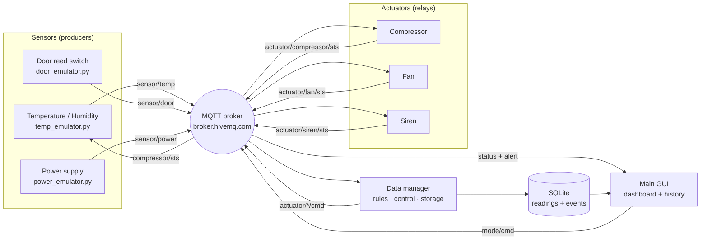

# Cold Chain Monitor

An IoT monitoring system for a pharmaceutical refrigerator, built for the HIT IoT
course project.

Vaccines and many medicines must be kept between **2 °C and 8 °C**. A unit that
drifts out of that band for long enough spoils its entire contents, and the loss
is only discovered later unless something is watching. This project is that
watcher: three kinds of emulated devices publish to an MQTT broker, a data
manager applies the storage rules and drives the cooling hardware, and an
operator GUI shows the live state plus the stored audit trail.


---

## Architecture

Eight independent processes, each with its own MQTT connection, exactly as
separate physical devices would behave.



The compressor status feeds back into the temperature sensor, so the whole thing
is a **closed control loop**: the cabinet actually cools down when the manager
switches the compressor on, and warms up again when it switches off.

---

## Components

| Component | File | Role |
|---|---|---|
| Temperature / humidity sensor | `emulators/temp_emulator.py` | Data producer. Runs a thermal model of the cabinet and publishes a JSON sample every 3 s. Cooling failures and sensor drop-outs can be injected. |
| Door sensor | `emulators/door_emulator.py` | Operator input. Retained OPEN / CLOSED state, with an optional auto-close. |
| Power supply sensor | `emulators/power_emulator.py` | Reports mains vs. backup battery and the charge level, which drains while on battery. |
| Compressor relay | `emulators/compressor_emulator.py` | Actuator. Cooling element. |
| Fan relay | `emulators/fan_emulator.py` | Actuator. Air circulation. |
| Siren relay | `emulators/siren_emulator.py` | Actuator. Audible alarm. |
| Data manager | `data_manager/data_manager.py` | Subscribes to every sensor, evaluates the rules once per second, drives the actuators, writes to SQLite and publishes status and alerts. |
| Main GUI | `gui/main_gui.py` | Operator dashboard and the history / reports tab. |

The three relays share `emulators/relay_base.py` because a relay is a relay; only
the name, topics and colour differ. All windows share the palette in
`ui/theme.py`, and every process uses the same MQTT wrapper in
`config/mqtt_client.py`.

---

## MQTT topics

Root: `HIT/coldchain/ofir/unit1`

| Topic | Direction | Payload |
|---|---|---|
| `sensor/temp` | sensor → manager, GUI | `{"temperature": 5.2, "humidity": 46.0, "unit": "C"}` |
| `sensor/door` | sensor → manager (retained) | `{"state": "OPEN"}` |
| `sensor/power` | sensor → manager (retained) | `{"source": "BATTERY", "battery": 74.0}` |
| `actuator/<device>/cmd` | manager → relay | `ON` / `OFF` |
| `actuator/<device>/sts` | relay → manager, GUI (retained) | `ON` / `OFF` |
| `alert` | manager → GUI | `{"level": "ALARM", "code": "DOOR_OPEN", "message": "...", "ts": "..."}` |
| `status` | manager → GUI | consolidated snapshot, once per second |
| `mode/cmd` | GUI → manager (retained) | `MONITORING` / `MAINTENANCE` |

`<device>` is one of `compressor`, `fan`, `siren`.

---

## Rules

All thresholds live in `config/mqtt_init.py`.

**Instantaneous**

| Condition | Level |
|---|---|
| Temperature outside 2–8 °C | WARNING |
| Temperature outside 0–10 °C | ALARM |
| Humidity outside 30–70 % | WARNING |
| Humidity above 85 % | ALARM (condensation risk) |

**Time based** — these are what make the manager more than a thermometer, and
they are the reason it keeps state instead of reacting message by message:

| Condition | Level |
|---|---|
| Door open longer than 20 s | WARNING |
| Door open longer than 45 s | ALARM |
| Temperature continuously outside 2–8 °C for 90 s | ALARM — stock at risk |
| Running on backup battery for 60 s | WARNING |
| Backup battery at or below 20 % | ALARM |
| No sensor message for 25 s | ALARM — sensor offline |

**Control**

* Compressor uses hysteresis: on above 6.5 °C, off below 3.5 °C, so the relay
  does not chatter around the 8 °C limit.
* The compressor is forced off while the door is open, the way real units behave
  so the coil does not ice up.
* The fan follows the compressor, and also runs when humidity is high.
* The siren follows any active ALARM.
* **Maintenance mode** suppresses escalation while a technician services the
  unit. Conditions are still logged; the unit just is not driven to alarm.

Alerts are **de-duplicated**: a row is written when a condition starts and when
it clears, not on every one-second evaluation.

---

## Database

SQLite, in WAL mode so the GUI can read while the manager writes.

* `readings` — a full state snapshot every 5 s: temperature, humidity, door,
  power, battery, all three actuator states and the resulting level. This is the
  audit trail a regulator would ask for.
* `events` — one row per alert transition, with level, code and message.

The History tab reads both back, summarises the last 24 hours (min / max /
average temperature, minutes spent out of band, warning and alarm counts) and
exports the readings to CSV.


---

## Running it

Requires Python 3.8+.

```bash
pip install -r requirements.txt
```

macOS / Linux:

```bash
./start_all.sh
```

Windows:

```
start_all.bat
```

Both scripts start all eight processes. To run a single component:

```bash
python data_manager/data_manager.py
python gui/main_gui.py
python emulators/temp_emulator.py
```

The GUI connects to the broker on its own; the emulators connect on start-up.
Order does not matter — retained messages and the periodic actuator refresh let
components join late.

### Demo script

1. Start everything. The unit settles into its cooling cycle, compressor
   switching on around 6.5 °C and off around 3.5 °C.
2. **Open the door.** Warm air enters, the compressor stops, and after 20 s the
   door warning appears; after 45 s it becomes an alarm and the siren switches on.
3. **Close the door** and watch the conditions clear.
4. On the sensor window, tick **Inject cooling failure**. The compressor keeps
   being commanded on but the temperature climbs anyway, first out of the storage
   band (warning), then past the hard limit and past 90 s of excursion (two
   separate alarms).
5. On the power window, press **Simulate power cut** and let the battery drain
   through the warning and the low-battery alarm.
6. Untick the sensor's **online** box to demonstrate the sensor-offline alarm.
7. Open **History & Reports** to show the stored audit trail and export a CSV.


---

## Configuration

Everything tunable is in `config/mqtt_init.py`: broker choice (`BROKER_INDEX`,
0 = HIT college broker, 1 = public HiveMQ), the topic root, all thresholds and
all timings. Change `TOPIC_ROOT` if two people run the project against the public
broker at the same time.

## Note for macOS

Some PyQt5 wheels do not export their Qt plugin directory and Qt then refuses to
start with `Could not find the Qt platform plugin "cocoa"`. `ui/qt_env.py` sets
the path from the installed package before the first window is created, so no
environment variable is needed.

---

## Layout

```
ColdChainMonitor/
├── config/          broker settings, topics, thresholds, MQTT wrapper
├── database/        SQLite schema, queries, CSV export
├── emulators/       three sensors, three relays, shared window chrome
├── data_manager/    rules, control loop, persistence
├── gui/             operator dashboard and history
├── ui/              shared theme and Qt bootstrap
├── docs/            screenshots
├── start_all.sh     launcher (macOS / Linux)
└── start_all.bat    launcher (Windows)
```
