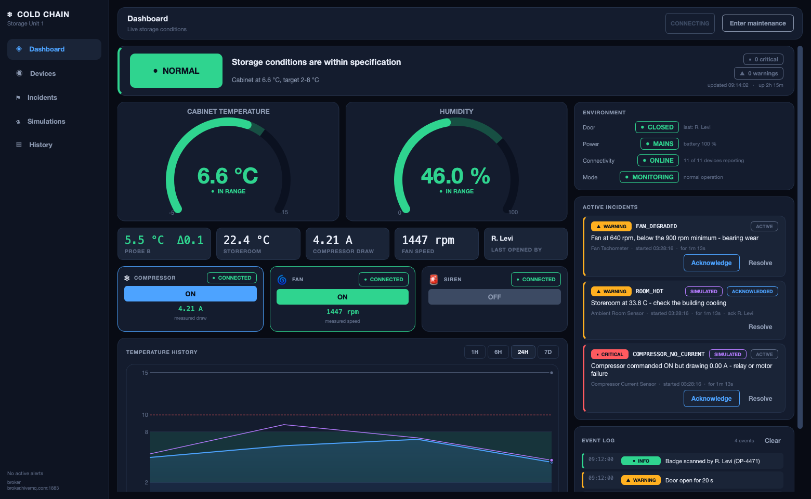
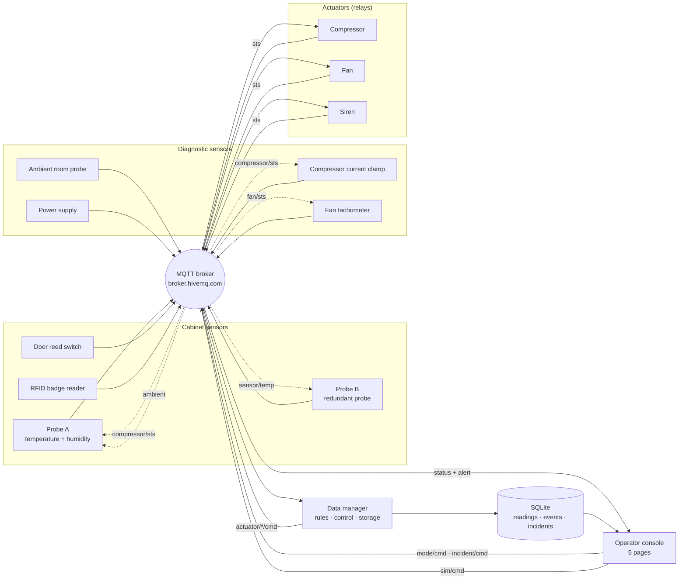
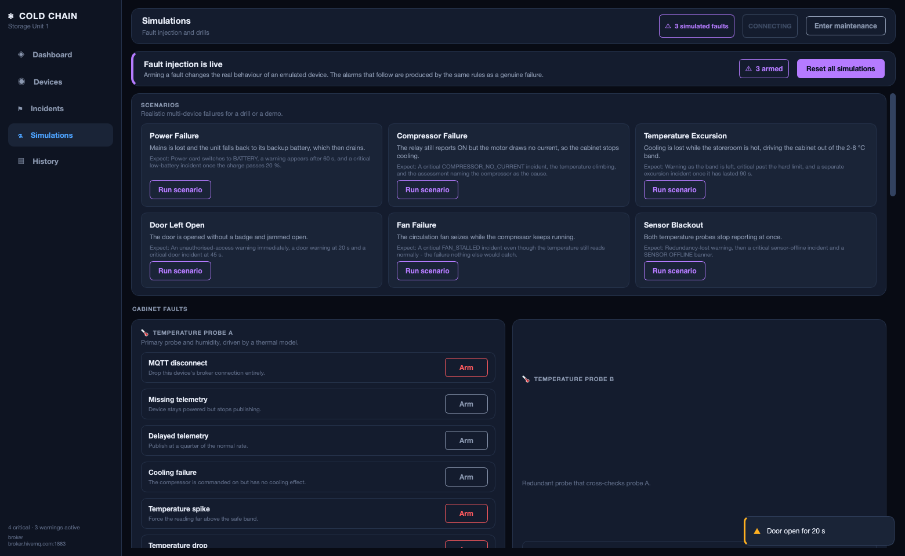
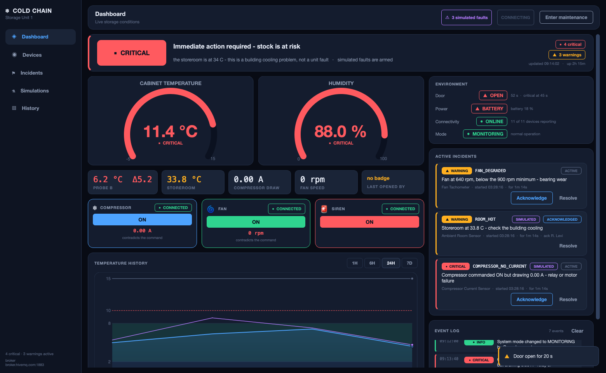
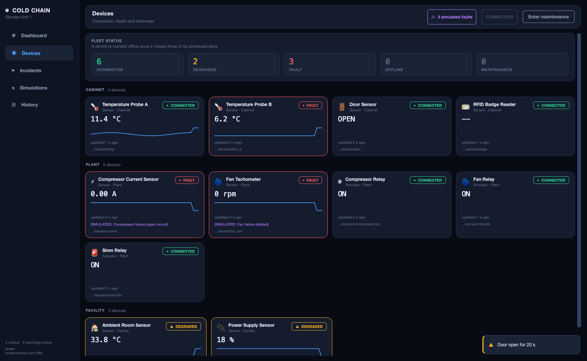
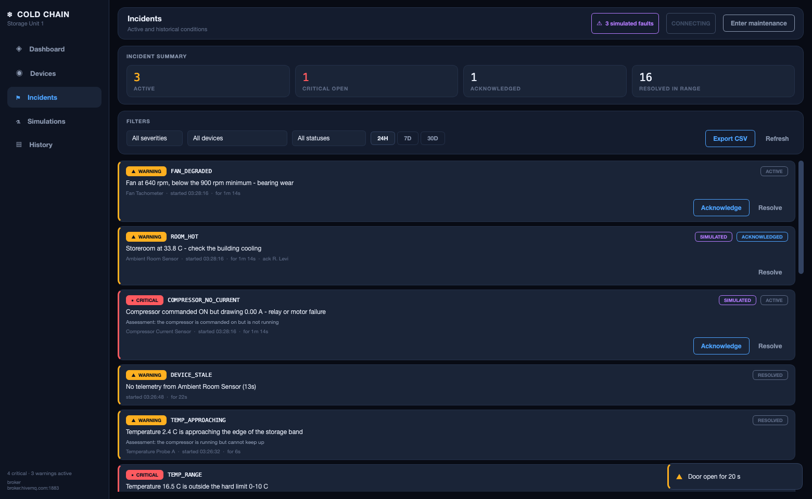
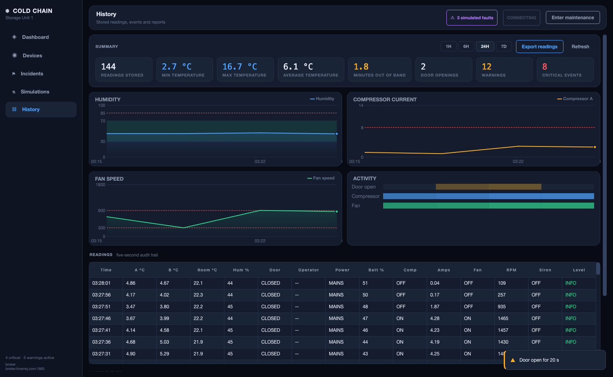

# Cold Chain Monitor

An IoT monitoring and control system for a pharmaceutical refrigerator, built as
the final project for the HIT IoT course.

> **Looking for setup and run instructions?** They are in **[RUNNING.md](RUNNING.md)**.

---

## The problem

Vaccines and many medicines must be stored between **2 °C and 8 °C**. A unit that
drifts outside that band for long enough spoils its entire contents — and because
the damage is invisible, the loss is usually discovered only when the medicine
fails to work.

Two things make this hard to catch with a plain thermometer:

1. **Duration matters more than the reading.** A cabinet at 9 °C for ten seconds
   while somebody takes out a box is fine. The same 9 °C for two minutes is not.
2. **The causes are not temperature.** A door left ajar, a power cut, a dead
   sensor — each ends in spoiled stock, and each needs to be caught *before* the
   temperature has moved.

This project addresses both. Eleven emulated devices publish to an MQTT broker; a
data manager applies duration-aware storage rules, drives the cooling hardware
and maintains an incident record; and a five-page operator console shows live
conditions, device health, incidents, the stored audit trail, and a fault
injection bench for proving the alarms actually work.



---

## Architecture

Fourteen independent processes: eleven emulated devices, the data manager, and
the GUI. Nothing imports another component's state — everything travels over the
broker.



### The closed loops

The dotted edges are what make this a system rather than a dashboard over a
random number generator. Probe A does not invent readings — it runs a thermal
model of the cabinet driven by what the rest of the system actually does:

* while the compressor runs, the temperature falls,
* while the door is open, warm room air leaks in far faster,
* the **ambient sensor** sets what the cabinet is leaking *towards*, so a hot
  storeroom genuinely makes cooling harder,
* with a cooling fault injected, the compressor is commanded on but has no effect.

The same principle drives the diagnostic sensors: the current clamp watches the
compressor's status topic, the tachometer watches the fan's, and probe B watches
probe A. So sensor → manager → relay → sensor is a real feedback loop, and so is
ambient → cabinet → manager → compressor.

### Trust nothing, measure everything

The original three sensors watched the *environment*. The five added later watch
**the system itself**, and each answers a question the others cannot:

| Sensor | Question it answers |
|---|---|
| Probe B | Is the measurement itself trustworthy? |
| Compressor current | Did the hardware do what it was told? |
| Fan tachometer | Is the air actually moving? |
| Ambient probe | Is this our fault or the building's? |
| Badge reader | Who did this, and were they allowed to? |

Without them the manager believes every relay that says `ON`, and every probe
that reports a number. With them, a welded contactor, a seized fan, a drifting
probe and an unbadged entry all become visible.

---

## Components

**Cabinet sensors** — what is happening inside the unit:

| Component | File | Role |
|---|---|---|
| Temperature probe A | `emulators/temp_emulator.py` | Primary probe. Thermal model of the cabinet, JSON sample every 3 s. Reports humidity too. |
| Temperature probe B | `emulators/temp_b_emulator.py` | Redundant probe that cross-checks probe A. |
| Door sensor | `emulators/door_emulator.py` | Reed switch. Retained OPEN / CLOSED state. |
| RFID badge reader | `emulators/badge_emulator.py` | Names the operator responsible for the next door opening. Three staff badges. |

**Diagnostic sensors** — whether the equipment and the building are healthy:

| Component | File | Role |
|---|---|---|
| Ambient room probe | `emulators/ambient_emulator.py` | Storeroom temperature outside the cabinet. |
| Compressor current clamp | `emulators/current_emulator.py` | Measures what the motor really draws, including start-up inrush. |
| Fan tachometer | `emulators/fan_rpm_emulator.py` | Measures whether the fan really turns. |
| Power supply sensor | `emulators/power_emulator.py` | Mains vs. backup battery, with a drain while on battery. |

**Actuators and applications:**

| Component | File | Role |
|---|---|---|
| Compressor relay | `emulators/compressor_emulator.py` | The cooling element. |
| Fan relay | `emulators/fan_emulator.py` | Air circulation. |
| Siren relay | `emulators/siren_emulator.py` | Audible alarm. |
| Data manager | `data_manager/data_manager.py` | Subscribes to every sensor, evaluates the rules once per second, drives the actuators, writes to SQLite, publishes status and alerts. |
| Operator console | `gui/main_gui.py` | Five-page console: Dashboard, Devices, Incidents, Simulations, History. |
| Device panel | `emulators/device_panel.py` | Optional shell that hosts all eleven devices in one window. |

Faults are no longer switches on each emulator window - they are armed from the
console's **Simulations** page, so one screen drives every device and every
armed fault is labelled `SIMULATED` wherever it surfaces.



### Two ways to run the same devices

Each device is written once as an **`EmulatorPanel`** — a self-contained card
that owns its own MQTT client. That panel is then shown one of two ways:

* **One process per device** (`start_all`) — thirteen processes, thirteen
  windows. This is how real hardware behaves, and it matches the course's
  reference project.
* **One window for all devices** (`start_panel`) — three processes. Far easier
  to arrange on screen and to record.

The two modes run *identical device code* and open *identical MQTT connections*:
eleven clients with eleven distinct client ids on the broker either way. Only the
window chrome differs. Nothing about the message flow, the topics or the rules
changes.


---

## The operator console

Five pages, each answering a different question.

| Page | Answers |
|---|---|
| **Dashboard** | Is the stock safe right now, and if not, why? |
| **Devices** | Is every device connected, and how fresh is its data? |
| **Incidents** | What has gone wrong, who acknowledged it, how long did it last? |
| **Simulations** | Does the alarm actually fire when this fails? |
| **History** | What does the stored record say? |

The dashboard is ordered the way an operator asks: a single status banner and a
plain-language headline first, then the two gauges, then the diagnostic
readings, then each actuator's command *beside an independent measurement of
it*, then history and the live log.



Status is never carried by colour alone — every severity and health state pairs
its colour with a glyph and a word, so the screen is still readable without
colour vision.

### Device health

The manager tracks when each device was last heard from and derives one of five
states. A scheduled publisher that misses roughly three of its slots is marked
offline; nothing waits for a human to notice the silence.

| State | Meaning |
|---|---|
| `CONNECTED` | Reporting on time, no active condition |
| `DEGRADED` | A warning is attributed to it, or a simulated fault is armed |
| `FAULT` | A critical condition is attributed to it |
| `OFFLINE` | Telemetry has stopped |
| `MAINTENANCE` | The unit is in maintenance mode |



### Incidents

An event records that something happened; an **incident** tracks a condition
from the moment it starts, through acknowledgement, to the moment it clears —
with its duration, the device it belongs to, and the assessment the system made
of its cause. Re-raising the same code does not open a second incident, so a
condition that lasts an hour stays one row rather than three thousand.

Acknowledging and resolving are published as commands and applied by the
manager, so the manager stays the only writer of incident state.



### Fault injection

Every rule the system enforces is demonstrable on demand. The Simulations page
arms **69 faults across the 11 devices**, plus six one-click scenarios that
combine them into realistic failures.

Nothing here fakes data. Arming a fault changes what the emulated hardware
actually does — the device really stops publishing, really draws no current,
really reports a frozen value — so the alarm that follows travels the same path
a genuine failure would. Every armed fault is labelled `SIMULATED` on the
device, in the event log, and on the incident record.

Three faults are implemented once in the emulator base class and therefore
available on every device: a dropped broker connection, silence, and
quarter-rate publishing. A simulated link outage heals itself after 30 seconds,
because a device with its connection cut cannot hear the command to restore it.

| Scenario | What it arms |
|---|---|
| Power Failure | Mains lost, then rapid battery depletion |
| Compressor Failure | Open circuit on the compressor, cooling lost |
| Temperature Excursion | Cooling failure while the storeroom is hot |
| Door Left Open | Door jammed open with no badge |
| Fan Failure | Circulation fan seized |
| Sensor Blackout | Both temperature probes stop reporting |

---

## MQTT topics

Root: `HIT/coldchain/ofir/unit1`

| Topic | Direction | Payload |
|---|---|---|
| `sensor/temp` | probe A → manager, probe B | `{"temperature": 5.2, "humidity": 46.0, "unit": "C"}` |
| `sensor/temp_b` | probe B → manager | `{"temperature": 5.35, "unit": "C"}` |
| `sensor/ambient` | room probe → manager, probe A *(retained)* | `{"ambient": 22.4, "unit": "C"}` |
| `sensor/door` | reed switch → manager *(retained)* | `{"state": "OPEN"}` |
| `sensor/badge` | reader → manager | `{"operator_id": "OP-4471", "name": "R. Levi", "role": "Pharmacist"}` |
| `sensor/power` | supply → manager *(retained)* | `{"source": "BATTERY", "battery": 74.0}` |
| `sensor/current` | clamp → manager | `{"current": 4.21, "unit": "A"}` |
| `sensor/fan_rpm` | tachometer → manager | `{"rpm": 1447, "unit": "rpm"}` |
| `actuator/<device>/cmd` | manager → relay | `ON` / `OFF` |
| `actuator/<device>/sts` | relay → manager, GUI, sensors *(retained)* | `ON` / `OFF` |
| `alert` | manager → GUI | `{"level": "ALARM", "code": "DOOR_OPEN", "message": "...", "operator": "R. Levi", "ts": "..."}` |
| `status` | manager → GUI | consolidated snapshot, once per second |
| `mode/cmd` | console → manager *(retained)* | `{"mode": "MAINTENANCE", "operator": "..."}` |
| `incident/cmd` | console → manager | `{"action": "acknowledge", "id": 42, "operator": "..."}` |
| `sim/cmd` | console → every device | `{"action": "set", "device": "current", "fault": "open_circuit", "active": true}` |
| `sim/sts/<device>` | device → manager, console *(retained)* | `{"device": "current", "faults": ["open_circuit"]}` |

`<device>` is one of `compressor`, `fan`, `siren`.

**Why commands and statuses are separate topics.** A command says what the
manager *wants*; a status says what the relay *did*. The GUI shows the status,
so the dashboard reflects the hardware rather than an assumption about it. It
also means a relay that starts late is not silently missing — it announces its
state on connect, and the manager re-sends commands every 15 s.

---

## Rules

All thresholds and timings live in `config/mqtt_init.py`.

### Instantaneous

| Condition | Level |
|---|---|
| Temperature outside 2–8 °C | WARNING |
| Temperature outside 0–10 °C | CRITICAL |
| Humidity outside 30–70 % | WARNING |
| Humidity above 85 % | CRITICAL — condensation risk |

### Time based

These are the rules that make the manager more than a thermometer, and the
reason it holds state instead of reacting message by message:

| Condition | Level |
|---|---|
| Door open longer than 20 s | WARNING |
| Door open longer than 45 s | CRITICAL |
| Temperature continuously outside 2–8 °C for 90 s | CRITICAL — stock at risk |
| Probes disagreeing by more than 2 °C for 30 s | CRITICAL — readings untrustworthy |
| Running on backup battery for 60 s | WARNING |
| Backup battery at or below 20 % | CRITICAL |
| No sensor message for 25 s | CRITICAL — sensor offline |
| Probe B silent for 30 s | WARNING — redundancy lost |

The sensor-offline rule has a start-up grace period, so a manager launched
before the emulators does not alarm on its first tick.

### Command versus reality

Every rule above trusts the relays. These do not — they compare what the manager
*commanded* against what the sensors *measured*, after a 15 s grace period so
the hardware has time to respond.

| Condition | Level | What it means |
|---|---|---|
| Compressor ON, drawing under 0.5 A | CRITICAL | Burnt contact, tripped overload, or a seized motor |
| Compressor OFF, still drawing current | CRITICAL | Contacts welded closed — the cabinet will freeze its contents |
| Compressor drawing over 8 A | CRITICAL | Straining or shorting |
| Fan ON, under 300 rpm | CRITICAL | Blocked or seized |
| Fan ON, under 900 rpm | WARNING | Turning but too slowly — bearing wear, service it before it fails |
| Fan OFF, still turning | WARNING | Welded contact |

A stalled fan is the subtle one. The cabinet may still average 5 °C, so every
temperature rule stays quiet while the air stops moving and the top shelf drifts
far warmer than the bottom.

### Access control

| Condition | Level |
|---|---|
| Door opened with no badge scanned in the last 60 s | WARNING — unauthorised access |

A badge scan does not unlock anything; a reader cannot physically stop anyone.
It attributes the opening, so the audit trail reads *"Door open 38 s — R. Levi"*
instead of an anonymous event, and an unbadged entry is recorded as exactly that.

### Root-cause assessment

Knowing the cabinet is warm is only half an alert — the response differs
completely depending on why. When the temperature is above the band, the manager
combines the diagnostic sensors into a plain-language cause, which is attached to
the excursion alarm and shown on the dashboard:

| Evidence | Assessment |
|---|---|
| Door is open | *the door is open* |
| Room at or above 30 °C | *this is a building cooling problem, not a unit fault* |
| Compressor ON but no current | *the compressor is commanded on but is not running* |
| Compressor ON, fan not turning | *the compressor is running but the fan is not circulating* |
| Compressor ON, everything healthy | *the compressor is running but cannot keep up* |

Each of those sends a different person: the storeroom staff, the building
engineer, the refrigeration technician.

### Control logic

* **Hysteresis.** The compressor switches on above 6.5 °C and off below 3.5 °C.
  A single threshold at 8 °C would make the relay chatter on and off every few
  seconds around the limit.
* **Door lockout.** The compressor is forced off while the door is open, the way
  real units behave so the evaporator coil does not ice up.
* **Fan.** Follows the compressor, and also runs on its own when humidity is high.
* **Siren.** Follows any active ALARM.
* **Maintenance mode.** Suppresses escalation while a technician services the
  unit. Conditions are still evaluated and logged — the unit is simply not driven
  to alarm, and the actuators are parked off.

### Alert de-duplication

An event is written when a condition **starts** and when it **clears** — not on
every one-second evaluation. Without this, ninety seconds of an open door would
produce ninety identical warning rows and the log would be unreadable. The
manager tracks the active level per alert code and only writes on a transition.


---

## Database

SQLite, in WAL mode so the GUI can read while the manager writes.

**`readings`** — a full state snapshot every 5 s: both probes, room temperature,
humidity, door state and the operator it is attributed to, power source and
battery, each actuator's commanded state *next to its measured feedback*, and
the resulting alert level. This is the audit trail a regulator would ask for.

**`events`** — one row per alert transition: timestamp, level, code, message,
operator, device, and whether it came from a simulated fault.

**`incidents`** — the lifecycle of a condition: code, severity, device, message,
the assessed root cause, when it started and ended, who acknowledged it and
when, its status, and whether it was simulated. Charts read from a single
bucketed query that averages roughly one point per pixel column, so a seven-day
view costs the same to draw as an hourly one.

The columns are declared once in `db.READING_FIELDS` and the INSERT is generated
from that list, so adding a sensor means adding one entry. A database written by
an earlier version is upgraded in place with `ALTER TABLE` rather than having to
be deleted.

The History tab reads both back, summarises the last 24 hours — minimum, maximum
and average temperature, minutes spent out of band, door openings, warning and
alarm counts — and exports the readings to CSV.



---

## Design notes

**One writer per kind of state.** The manager is the only process that writes
incidents; the console asks for changes over MQTT and reads the result back.
That removes a whole class of race between two processes editing the same row.

**Work off the network thread.** paho delivers callbacks on its own thread. The
manager's handlers only mutate state under a lock and append to a journal; every
database write and every publish happens on the manager's own loop, so a slow
disk can never stall message dispatch.

**Reject implausible readings.** A sensor reporting 1e9 degrees has
malfunctioned. Treating that as a measurement would raise a temperature alarm
instead of a sensor fault, so values outside a plausibility band are discarded.

**Shared modules over copy-paste.** The three relays are behaviourally identical,
so they share `emulators/relay_base.py`; only the name, topics and colour differ.
Every process uses the same MQTT wrapper (`config/mqtt_client.py`) and the same
palette (`ui/theme.py`). Each emulator is still a separate process with its own
broker connection — the sharing is in the source, not at runtime.

**Threading.** paho-mqtt delivers callbacks on its own network thread, and Qt
widgets may only be touched from the main thread. Every GUI process converts
incoming messages into Qt signals before anything on screen is updated. The data
manager, which has no GUI, guards its state with a lock instead.

**JSON payloads.** Sensor messages are JSON rather than formatted strings, so
adding a field does not break every parser, and a malformed message is rejected
cleanly instead of raising an exception inside a callback.

---

## Project layout

```
ColdChainMonitor/
├── config/          broker settings, topic tree, thresholds, device registry,
│                    fault catalogue, MQTT wrapper
├── database/        SQLite schema, incidents, chart aggregates, CSV export
├── emulators/       eight sensors, three relays, shared panel base, device panel
├── data_manager/    rules, control loop, incidents, device health, persistence
├── gui/             console shell, charts, composite widgets
│   └── pages/       dashboard, devices, incidents, simulations, history
├── ui/              design tokens, reusable widgets, Qt bootstrap
├── docs/            screenshots
├── run/
│   ├── macos/       start_all.command, start_panel.command
│   └── windows/     start_all.bat, start_panel.bat
├── README.md        this file
├── RUNNING.md       installation, running, demo script, troubleshooting
└── requirements.txt
```

---

## Configuration

Everything tunable is in `config/mqtt_init.py`:

| Setting | Meaning |
|---|---|
| `BROKER_INDEX` | `0` = HIT college broker, `1` = public HiveMQ |
| `TOPIC_ROOT` | Topic namespace — change it if two people run against the public broker at once |
| `TEMP_TARGET_MIN` / `MAX` | The storage band |
| `TEMP_ALARM_MIN` / `MAX` | Hard limits |
| `DOOR_WARNING_SECONDS`, `DOOR_ALARM_SECONDS` | Door timers |
| `EXCURSION_ALARM_SECONDS` | Tolerated excursion duration |
| `COMPRESSOR_ON_ABOVE` / `OFF_BELOW` | Hysteresis band |
| `PROBE_DISAGREE_C`, `PROBE_DISAGREE_SECONDS` | How far apart the probes may drift, and for how long |
| `CURRENT_RUNNING_MIN_A`, `CURRENT_OVERLOAD_A` | Compressor current limits |
| `FAN_RPM_MIN`, `FAN_RPM_DEGRADED` | Fan speed limits |
| `ACTUATOR_FAULT_SECONDS` | Grace period before a command is judged against its feedback |
| `AMBIENT_WARNING_C` | Room temperature that indicates a facility problem |
| `BADGE_VALID_SECONDS` | How long a badge scan authorises a door opening |
| `MQTT_DOWN_SECONDS` | How long the broker may be unreachable before it is a fault |
| `SIM_OUTAGE_SECONDS` | How long a simulated link outage lasts before it heals |
| `VALID_*_RANGE` | Plausibility limits; readings outside these are rejected as malformed rather than alarmed on |
| `SENSOR_PUBLISH_MS`, `DB_WRITE_INTERVAL_S` | Timing |

Shortening the timers is useful when recording a demo — see
[RUNNING.md](RUNNING.md).
