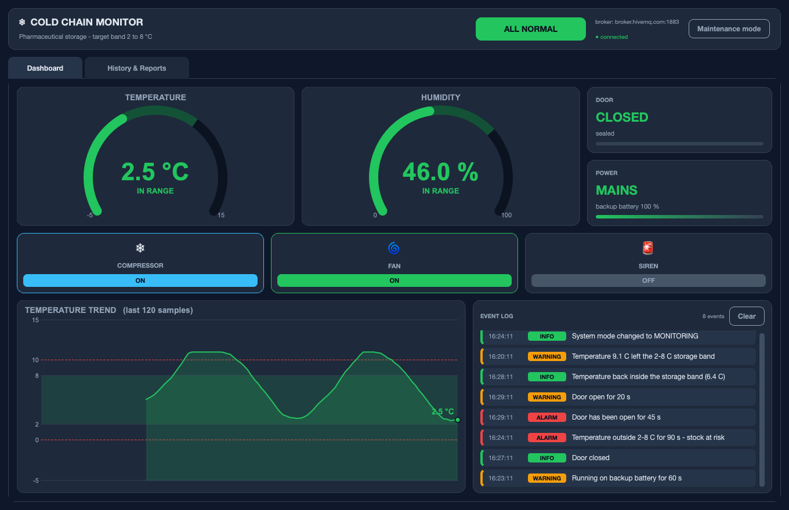
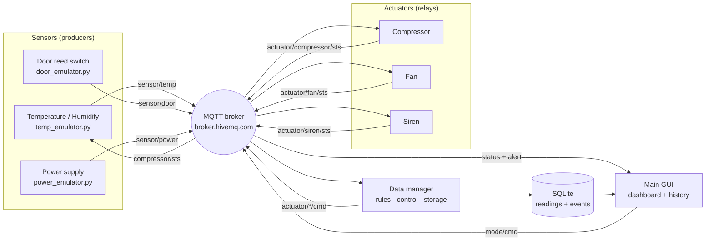
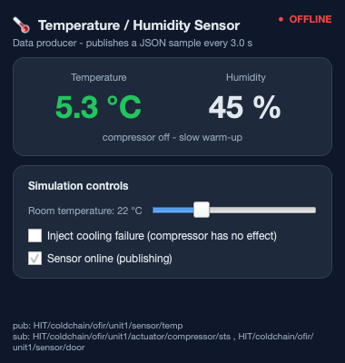
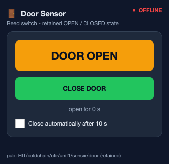
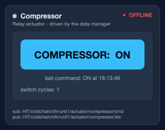
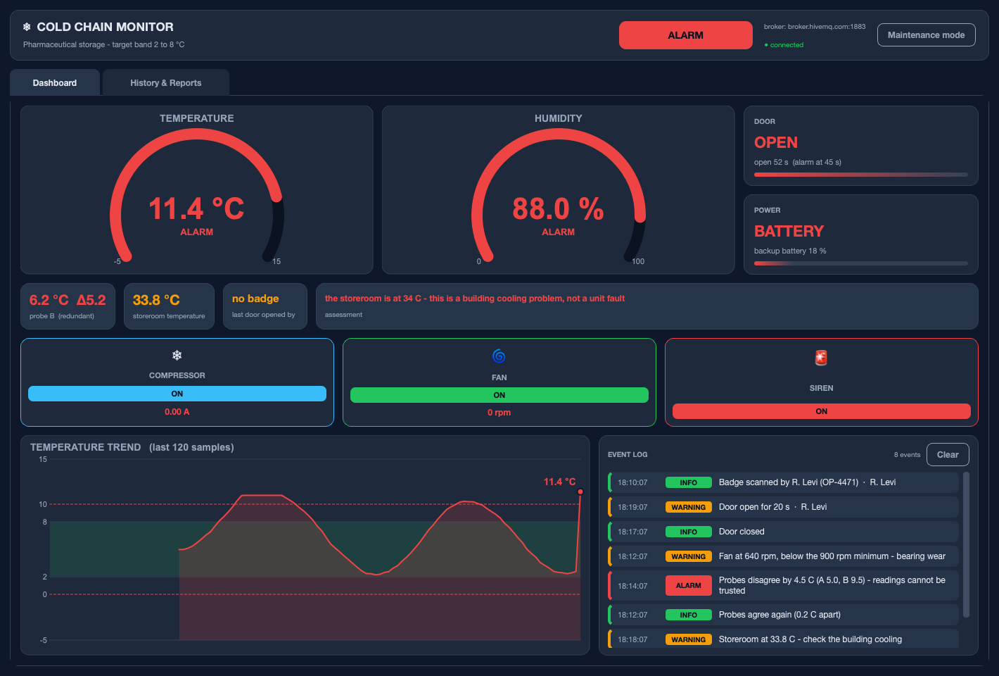
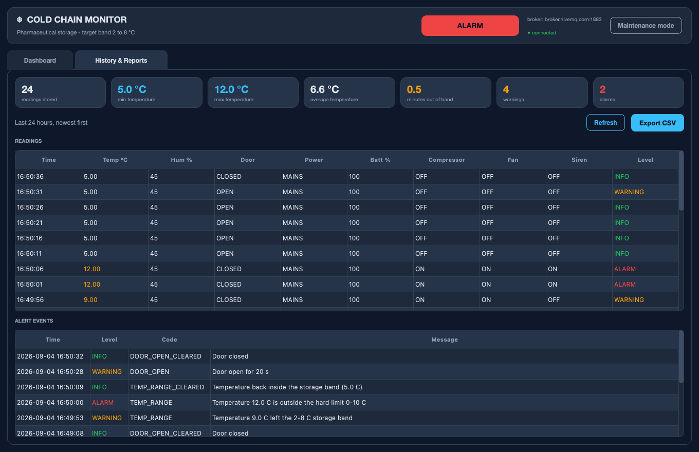

# Cold Chain Monitor

An IoT monitoring and control system for a pharmaceutical refrigerator, built as
the final project for the HIT IoT course.

> **Looking for setup and run instructions?** They are in **[RUNNING.md](RUNNING.md)**.

---

## The problem

Vaccines and many medicines must be stored between **2 °C and 8 °C**. A unit that
drifts outside that band for long enough spoils its entire contents — and because
the damage is invisible, the loss is usually discovered only when the medicine
fails to work.

Two things make this hard to catch with a plain thermometer:

1. **Duration matters more than the reading.** A cabinet at 9 °C for ten seconds
   while somebody takes out a box is fine. The same 9 °C for two minutes is not.
2. **The causes are not temperature.** A door left ajar, a power cut, a dead
   sensor — each ends in spoiled stock, and each needs to be caught *before* the
   temperature has moved.

This project addresses both: three kinds of emulated devices publish to an MQTT
broker, a data manager applies duration-aware storage rules and drives the
cooling hardware, and an operator GUI shows the live state plus the stored audit
trail.



---

## Architecture

Eight independent processes, each with its own MQTT connection — exactly how
separate physical devices behave. No process imports another's state; everything
travels over the broker.



### The closed loop

Note the last edge: the **compressor status feeds back into the temperature
sensor**. The sensor does not emit random numbers — it runs a thermal model of
the cabinet and reacts to what the system actually does:

* while the compressor runs, the temperature falls,
* while the door is open, warm room air leaks in far faster,
* with a cooling fault injected, the compressor is commanded on but has no
  effect.

So the system is a genuine control loop — sensor → manager → relay → sensor —
rather than a data generator with a dashboard attached.

---

## Components

| Component | File | Role |
|---|---|---|
| Temperature / humidity sensor | `emulators/temp_emulator.py` | Data producer. Thermal model of the cabinet, publishes a JSON sample every 3 s. Room temperature, cooling failure and sensor drop-out can all be varied at runtime. |
| Door sensor | `emulators/door_emulator.py` | Operator input. Retained OPEN / CLOSED state with an optional auto-close. |
| Power supply sensor | `emulators/power_emulator.py` | Reports mains vs. backup battery and the charge level, which drains while on battery. |
| Compressor relay | `emulators/compressor_emulator.py` | Actuator — the cooling element. |
| Fan relay | `emulators/fan_emulator.py` | Actuator — air circulation. |
| Siren relay | `emulators/siren_emulator.py` | Actuator — audible alarm. |
| Data manager | `data_manager/data_manager.py` | Subscribes to every sensor, evaluates the rules once per second, drives the actuators, writes to SQLite, publishes status and alerts. |
| Main GUI | `gui/main_gui.py` | Operator dashboard and the history / reports tab. |

<p align="center">
  
  
  
</p>

---

## MQTT topics

Root: `HIT/coldchain/ofir/unit1`

| Topic | Direction | Payload |
|---|---|---|
| `sensor/temp` | sensor → manager | `{"temperature": 5.2, "humidity": 46.0, "unit": "C"}` |
| `sensor/door` | sensor → manager *(retained)* | `{"state": "OPEN"}` |
| `sensor/power` | sensor → manager *(retained)* | `{"source": "BATTERY", "battery": 74.0}` |
| `actuator/<device>/cmd` | manager → relay | `ON` / `OFF` |
| `actuator/<device>/sts` | relay → manager, GUI *(retained)* | `ON` / `OFF` |
| `alert` | manager → GUI | `{"level": "ALARM", "code": "DOOR_OPEN", "message": "...", "ts": "..."}` |
| `status` | manager → GUI | consolidated snapshot, once per second |
| `mode/cmd` | GUI → manager *(retained)* | `MONITORING` / `MAINTENANCE` |

`<device>` is one of `compressor`, `fan`, `siren`.

**Why commands and statuses are separate topics.** A command says what the
manager *wants*; a status says what the relay *did*. The GUI shows the status,
so the dashboard reflects the hardware rather than an assumption about it. It
also means a relay that starts late is not silently missing — it announces its
state on connect, and the manager re-sends commands every 15 s.

---

## Rules

All thresholds and timings live in `config/mqtt_init.py`.

### Instantaneous

| Condition | Level |
|---|---|
| Temperature outside 2–8 °C | WARNING |
| Temperature outside 0–10 °C | ALARM |
| Humidity outside 30–70 % | WARNING |
| Humidity above 85 % | ALARM — condensation risk |

### Time based

These are the rules that make the manager more than a thermometer, and the
reason it holds state instead of reacting message by message:

| Condition | Level |
|---|---|
| Door open longer than 20 s | WARNING |
| Door open longer than 45 s | ALARM |
| Temperature continuously outside 2–8 °C for 90 s | ALARM — stock at risk |
| Running on backup battery for 60 s | WARNING |
| Backup battery at or below 20 % | ALARM |
| No sensor message for 25 s | ALARM — sensor offline |

The sensor-offline rule has a start-up grace period, so a manager launched
before the emulators does not alarm on its first tick.

### Control logic

* **Hysteresis.** The compressor switches on above 6.5 °C and off below 3.5 °C.
  A single threshold at 8 °C would make the relay chatter on and off every few
  seconds around the limit.
* **Door lockout.** The compressor is forced off while the door is open, the way
  real units behave so the evaporator coil does not ice up.
* **Fan.** Follows the compressor, and also runs on its own when humidity is high.
* **Siren.** Follows any active ALARM.
* **Maintenance mode.** Suppresses escalation while a technician services the
  unit. Conditions are still evaluated and logged — the unit is simply not driven
  to alarm, and the actuators are parked off.

### Alert de-duplication

An event is written when a condition **starts** and when it **clears** — not on
every one-second evaluation. Without this, ninety seconds of an open door would
produce ninety identical warning rows and the log would be unreadable. The
manager tracks the active level per alert code and only writes on a transition.



---

## Database

SQLite, in WAL mode so the GUI can read while the manager writes.

**`readings`** — a full state snapshot every 5 s: temperature, humidity, door,
power source, battery, all three actuator states, and the resulting alert level.
This is the audit trail a regulator would ask for.

**`events`** — one row per alert transition: timestamp, level, code, message.

The History tab reads both back, summarises the last 24 hours — minimum, maximum
and average temperature, minutes spent out of band, warning and alarm counts —
and exports the readings to CSV.



---

## Design notes

**Shared modules over copy-paste.** The three relays are behaviourally identical,
so they share `emulators/relay_base.py`; only the name, topics and colour differ.
Every process uses the same MQTT wrapper (`config/mqtt_client.py`) and the same
palette (`ui/theme.py`). Each emulator is still a separate process with its own
broker connection — the sharing is in the source, not at runtime.

**Threading.** paho-mqtt delivers callbacks on its own network thread, and Qt
widgets may only be touched from the main thread. Every GUI process converts
incoming messages into Qt signals before anything on screen is updated. The data
manager, which has no GUI, guards its state with a lock instead.

**JSON payloads.** Sensor messages are JSON rather than formatted strings, so
adding a field does not break every parser, and a malformed message is rejected
cleanly instead of raising an exception inside a callback.

---

## Project layout

```
ColdChainMonitor/
├── config/          broker settings, topic tree, thresholds, MQTT wrapper
├── database/        SQLite schema, queries, CSV export
├── emulators/       three sensors, three relays, shared window chrome
├── data_manager/    rules, control loop, persistence
├── gui/             operator dashboard and history
├── ui/              shared theme and Qt bootstrap
├── docs/            screenshots
├── README.md        this file
├── RUNNING.md       installation, running, demo script, troubleshooting
├── requirements.txt
├── start_all.sh     launcher (macOS / Linux)
└── start_all.bat    launcher (Windows)
```

---

## Configuration

Everything tunable is in `config/mqtt_init.py`:

| Setting | Meaning |
|---|---|
| `BROKER_INDEX` | `0` = HIT college broker, `1` = public HiveMQ |
| `TOPIC_ROOT` | Topic namespace — change it if two people run against the public broker at once |
| `TEMP_TARGET_MIN` / `MAX` | The storage band |
| `TEMP_ALARM_MIN` / `MAX` | Hard limits |
| `DOOR_WARNING_SECONDS`, `DOOR_ALARM_SECONDS` | Door timers |
| `EXCURSION_ALARM_SECONDS` | Tolerated excursion duration |
| `COMPRESSOR_ON_ABOVE` / `OFF_BELOW` | Hysteresis band |
| `SENSOR_PUBLISH_MS`, `DB_WRITE_INTERVAL_S` | Timing |

Shortening the timers is useful when recording a demo — see
[RUNNING.md](RUNNING.md).
