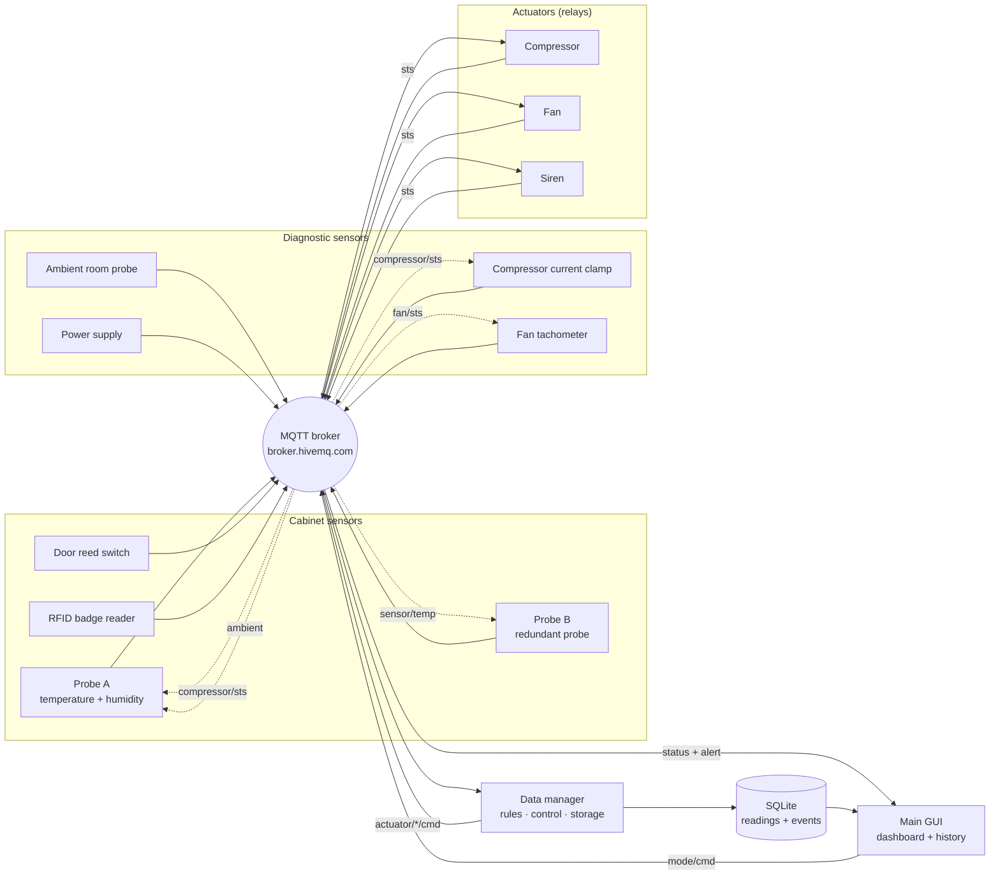
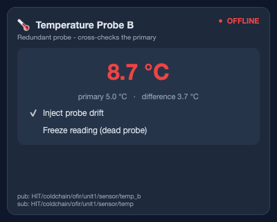
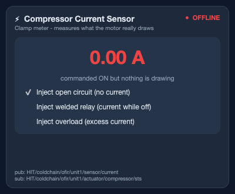
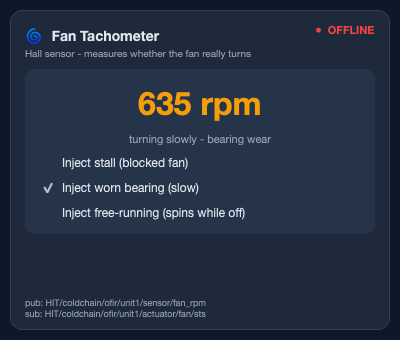
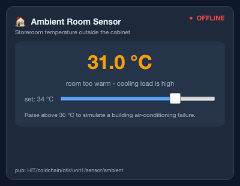
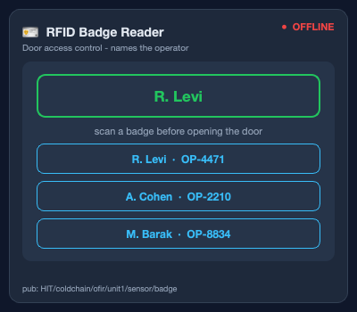

# Cold Chain Monitor

An IoT monitoring and control system for a pharmaceutical refrigerator, built as
the final project for the HIT IoT course.

> **Looking for setup and run instructions?** They are in **[RUNNING.md](RUNNING.md)**.

---

## The problem

Vaccines and many medicines must be stored between **2 °C and 8 °C**. A unit that
drifts outside that band for long enough spoils its entire contents — and because
the damage is invisible, the loss is usually discovered only when the medicine
fails to work.

Two things make this hard to catch with a plain thermometer:

1. **Duration matters more than the reading.** A cabinet at 9 °C for ten seconds
   while somebody takes out a box is fine. The same 9 °C for two minutes is not.
2. **The causes are not temperature.** A door left ajar, a power cut, a dead
   sensor — each ends in spoiled stock, and each needs to be caught *before* the
   temperature has moved.

This project addresses both: three kinds of emulated devices publish to an MQTT
broker, a data manager applies duration-aware storage rules and drives the
cooling hardware, and an operator GUI shows the live state plus the stored audit
trail.


---

## Architecture

Eight independent processes, each with its own MQTT connection — exactly how
separate physical devices behave. No process imports another's state; everything
travels over the broker.

Fourteen independent processes: eleven emulated devices, the data manager, and
the GUI. Nothing imports another component's state — everything travels over the
broker.



### The closed loops

The dotted edges are what make this a system rather than a dashboard over a
random number generator. Probe A does not invent readings — it runs a thermal
model of the cabinet driven by what the rest of the system actually does:

* while the compressor runs, the temperature falls,
* while the door is open, warm room air leaks in far faster,
* the **ambient sensor** sets what the cabinet is leaking *towards*, so a hot
  storeroom genuinely makes cooling harder,
* with a cooling fault injected, the compressor is commanded on but has no effect.

The same principle drives the diagnostic sensors: the current clamp watches the
compressor's status topic, the tachometer watches the fan's, and probe B watches
probe A. So sensor → manager → relay → sensor is a real feedback loop, and so is
ambient → cabinet → manager → compressor.

### Trust nothing, measure everything

The original three sensors watched the *environment*. The five added later watch
**the system itself**, and each answers a question the others cannot:

| Sensor | Question it answers |
|---|---|
| Probe B | Is the measurement itself trustworthy? |
| Compressor current | Did the hardware do what it was told? |
| Fan tachometer | Is the air actually moving? |
| Ambient probe | Is this our fault or the building's? |
| Badge reader | Who did this, and were they allowed to? |

Without them the manager believes every relay that says `ON`, and every probe
that reports a number. With them, a welded contactor, a seized fan, a drifting
probe and an unbadged entry all become visible.

---

## Components

**Cabinet sensors** — what is happening inside the unit:

| Component | File | Role and fault switches |
|---|---|---|
| Temperature probe A | `emulators/temp_emulator.py` | Primary probe. Thermal model of the cabinet, JSON sample every 3 s. Inject *cooling failure* or take the sensor *offline*. |
| Temperature probe B | `emulators/temp_b_emulator.py` | Redundant probe that cross-checks probe A. Inject *drift* or *freeze* the reading. |
| Door sensor | `emulators/door_emulator.py` | Reed switch. Retained OPEN / CLOSED state with an optional auto-close. |
| RFID badge reader | `emulators/badge_emulator.py` | Names the operator responsible for the next door opening. Three staff badges. |

**Diagnostic sensors** — whether the equipment and the building are healthy:

| Component | File | Role and fault switches |
|---|---|---|
| Ambient room probe | `emulators/ambient_emulator.py` | Storeroom temperature. Raise it past 30 °C to simulate a building air-conditioning failure. |
| Compressor current clamp | `emulators/current_emulator.py` | Measures what the motor really draws, with start-up inrush. Inject *open circuit*, *welded relay* or *overload*. |
| Fan tachometer | `emulators/fan_rpm_emulator.py` | Measures whether the fan really turns. Inject *stall*, *worn bearing* or *free-running*. |
| Power supply sensor | `emulators/power_emulator.py` | Mains vs. backup battery, with a drain while on battery. |

**Actuators and applications:**

| Component | File | Role |
|---|---|---|
| Compressor relay | `emulators/compressor_emulator.py` | The cooling element. |
| Fan relay | `emulators/fan_emulator.py` | Air circulation. |
| Siren relay | `emulators/siren_emulator.py` | Audible alarm. |
| Data manager | `data_manager/data_manager.py` | Subscribes to every sensor, evaluates the rules once per second, drives the actuators, writes to SQLite, publishes status and alerts. |
| Main GUI | `gui/main_gui.py` | Operator dashboard and the history / reports tab. |
| Device panel | `emulators/device_panel.py` | Optional shell that hosts all eleven devices in one window. |

Every fault switch above exists so the corresponding rule can be demonstrated
live rather than described:

<p align="center">
  
  
  
</p>
<p align="center">
  
  
  
</p>

### Two ways to run the same devices

Each device is written once as an **`EmulatorPanel`** — a self-contained card
that owns its own MQTT client. That panel is then shown one of two ways:

* **One process per device** (`start_all`) — thirteen processes, thirteen
  windows. This is how real hardware behaves, and it matches the course's
  reference project.
* **One window for all devices** (`start_panel`) — three processes. Far easier
  to arrange on screen and to record.

The two modes run *identical device code* and open *identical MQTT connections*:
eleven clients with eleven distinct client ids on the broker either way. Only the
window chrome differs. Nothing about the message flow, the topics or the rules
changes.


---

## MQTT topics

Root: `HIT/coldchain/ofir/unit1`

| Topic | Direction | Payload |
|---|---|---|
| `sensor/temp` | probe A → manager, probe B | `{"temperature": 5.2, "humidity": 46.0, "unit": "C"}` |
| `sensor/temp_b` | probe B → manager | `{"temperature": 5.35, "unit": "C"}` |
| `sensor/ambient` | room probe → manager, probe A *(retained)* | `{"ambient": 22.4, "unit": "C"}` |
| `sensor/door` | reed switch → manager *(retained)* | `{"state": "OPEN"}` |
| `sensor/badge` | reader → manager | `{"operator_id": "OP-4471", "name": "R. Levi", "role": "Pharmacist"}` |
| `sensor/power` | supply → manager *(retained)* | `{"source": "BATTERY", "battery": 74.0}` |
| `sensor/current` | clamp → manager | `{"current": 4.21, "unit": "A"}` |
| `sensor/fan_rpm` | tachometer → manager | `{"rpm": 1447, "unit": "rpm"}` |
| `actuator/<device>/cmd` | manager → relay | `ON` / `OFF` |
| `actuator/<device>/sts` | relay → manager, GUI, sensors *(retained)* | `ON` / `OFF` |
| `alert` | manager → GUI | `{"level": "ALARM", "code": "DOOR_OPEN", "message": "...", "operator": "R. Levi", "ts": "..."}` |
| `status` | manager → GUI | consolidated snapshot, once per second |
| `mode/cmd` | GUI → manager *(retained)* | `MONITORING` / `MAINTENANCE` |

`<device>` is one of `compressor`, `fan`, `siren`.

**Why commands and statuses are separate topics.** A command says what the
manager *wants*; a status says what the relay *did*. The GUI shows the status,
so the dashboard reflects the hardware rather than an assumption about it. It
also means a relay that starts late is not silently missing — it announces its
state on connect, and the manager re-sends commands every 15 s.

---

## Rules

All thresholds and timings live in `config/mqtt_init.py`.

### Instantaneous

| Condition | Level |
|---|---|
| Temperature outside 2–8 °C | WARNING |
| Temperature outside 0–10 °C | ALARM |
| Humidity outside 30–70 % | WARNING |
| Humidity above 85 % | ALARM — condensation risk |

### Time based

These are the rules that make the manager more than a thermometer, and the
reason it holds state instead of reacting message by message:

| Condition | Level |
|---|---|
| Door open longer than 20 s | WARNING |
| Door open longer than 45 s | ALARM |
| Temperature continuously outside 2–8 °C for 90 s | ALARM — stock at risk |
| Probes disagreeing by more than 2 °C for 30 s | ALARM — readings untrustworthy |
| Running on backup battery for 60 s | WARNING |
| Backup battery at or below 20 % | ALARM |
| No sensor message for 25 s | ALARM — sensor offline |
| Probe B silent for 30 s | WARNING — redundancy lost |

The sensor-offline rule has a start-up grace period, so a manager launched
before the emulators does not alarm on its first tick.

### Command versus reality

Every rule above trusts the relays. These do not — they compare what the manager
*commanded* against what the sensors *measured*, after a 15 s grace period so
the hardware has time to respond.

| Condition | Level | What it means |
|---|---|---|
| Compressor ON, drawing under 0.5 A | ALARM | Burnt contact, tripped overload, or a seized motor |
| Compressor OFF, still drawing current | ALARM | Contacts welded closed — the cabinet will freeze its contents |
| Compressor drawing over 8 A | ALARM | Straining or shorting |
| Fan ON, under 300 rpm | ALARM | Blocked or seized |
| Fan ON, under 900 rpm | WARNING | Turning but too slowly — bearing wear, service it before it fails |
| Fan OFF, still turning | WARNING | Welded contact |

A stalled fan is the subtle one. The cabinet may still average 5 °C, so every
temperature rule stays quiet while the air stops moving and the top shelf drifts
far warmer than the bottom.

### Access control

| Condition | Level |
|---|---|
| Door opened with no badge scanned in the last 60 s | WARNING — unauthorised access |

A badge scan does not unlock anything; a reader cannot physically stop anyone.
It attributes the opening, so the audit trail reads *"Door open 38 s — R. Levi"*
instead of an anonymous event, and an unbadged entry is recorded as exactly that.

### Root-cause assessment

Knowing the cabinet is warm is only half an alert — the response differs
completely depending on why. When the temperature is above the band, the manager
combines the diagnostic sensors into a plain-language cause, which is attached to
the excursion alarm and shown on the dashboard:

| Evidence | Assessment |
|---|---|
| Door is open | *the door is open* |
| Room at or above 30 °C | *this is a building cooling problem, not a unit fault* |
| Compressor ON but no current | *the compressor is commanded on but is not running* |
| Compressor ON, fan not turning | *the compressor is running but the fan is not circulating* |
| Compressor ON, everything healthy | *the compressor is running but cannot keep up* |

Each of those sends a different person: the storeroom staff, the building
engineer, the refrigeration technician.

### Control logic

* **Hysteresis.** The compressor switches on above 6.5 °C and off below 3.5 °C.
  A single threshold at 8 °C would make the relay chatter on and off every few
  seconds around the limit.
* **Door lockout.** The compressor is forced off while the door is open, the way
  real units behave so the evaporator coil does not ice up.
* **Fan.** Follows the compressor, and also runs on its own when humidity is high.
* **Siren.** Follows any active ALARM.
* **Maintenance mode.** Suppresses escalation while a technician services the
  unit. Conditions are still evaluated and logged — the unit is simply not driven
  to alarm, and the actuators are parked off.

### Alert de-duplication

An event is written when a condition **starts** and when it **clears** — not on
every one-second evaluation. Without this, ninety seconds of an open door would
produce ninety identical warning rows and the log would be unreadable. The
manager tracks the active level per alert code and only writes on a transition.


---

## Database

SQLite, in WAL mode so the GUI can read while the manager writes.

**`readings`** — a full state snapshot every 5 s: both probes, room temperature,
humidity, door state and the operator it is attributed to, power source and
battery, each actuator's commanded state *next to its measured feedback*, and
the resulting alert level. This is the audit trail a regulator would ask for.

**`events`** — one row per alert transition: timestamp, level, code, message and
operator.

The columns are declared once in `db.READING_FIELDS` and the INSERT is generated
from that list, so adding a sensor means adding one entry. A database written by
an earlier version is upgraded in place with `ALTER TABLE` rather than having to
be deleted.

The History tab reads both back, summarises the last 24 hours — minimum, maximum
and average temperature, minutes spent out of band, door openings, warning and
alarm counts — and exports the readings to CSV.


---

## Design notes

**Shared modules over copy-paste.** The three relays are behaviourally identical,
so they share `emulators/relay_base.py`; only the name, topics and colour differ.
Every process uses the same MQTT wrapper (`config/mqtt_client.py`) and the same
palette (`ui/theme.py`). Each emulator is still a separate process with its own
broker connection — the sharing is in the source, not at runtime.

**Threading.** paho-mqtt delivers callbacks on its own network thread, and Qt
widgets may only be touched from the main thread. Every GUI process converts
incoming messages into Qt signals before anything on screen is updated. The data
manager, which has no GUI, guards its state with a lock instead.

**JSON payloads.** Sensor messages are JSON rather than formatted strings, so
adding a field does not break every parser, and a malformed message is rejected
cleanly instead of raising an exception inside a callback.

---

## Project layout

```
ColdChainMonitor/
├── config/          broker settings, topic tree, thresholds, MQTT wrapper
├── database/        SQLite schema, queries, CSV export
├── emulators/       eight sensors, three relays, shared panel base, device panel
├── data_manager/    rules, control loop, persistence
├── gui/             operator dashboard and history
├── ui/              shared theme and Qt bootstrap
├── docs/            screenshots
├── run/
│   ├── macos/       start_all.command, start_panel.command
│   └── windows/     start_all.bat, start_panel.bat
├── README.md        this file
├── RUNNING.md       installation, running, demo script, troubleshooting
└── requirements.txt
```

---

## Configuration

Everything tunable is in `config/mqtt_init.py`:

| Setting | Meaning |
|---|---|
| `BROKER_INDEX` | `0` = HIT college broker, `1` = public HiveMQ |
| `TOPIC_ROOT` | Topic namespace — change it if two people run against the public broker at once |
| `TEMP_TARGET_MIN` / `MAX` | The storage band |
| `TEMP_ALARM_MIN` / `MAX` | Hard limits |
| `DOOR_WARNING_SECONDS`, `DOOR_ALARM_SECONDS` | Door timers |
| `EXCURSION_ALARM_SECONDS` | Tolerated excursion duration |
| `COMPRESSOR_ON_ABOVE` / `OFF_BELOW` | Hysteresis band |
| `PROBE_DISAGREE_C`, `PROBE_DISAGREE_SECONDS` | How far apart the probes may drift, and for how long |
| `CURRENT_RUNNING_MIN_A`, `CURRENT_OVERLOAD_A` | Compressor current limits |
| `FAN_RPM_MIN`, `FAN_RPM_DEGRADED` | Fan speed limits |
| `ACTUATOR_FAULT_SECONDS` | Grace period before a command is judged against its feedback |
| `AMBIENT_WARNING_C` | Room temperature that indicates a facility problem |
| `BADGE_VALID_SECONDS` | How long a badge scan authorises a door opening |
| `SENSOR_PUBLISH_MS`, `DB_WRITE_INTERVAL_S` | Timing |

Shortening the timers is useful when recording a demo — see
[RUNNING.md](RUNNING.md).
