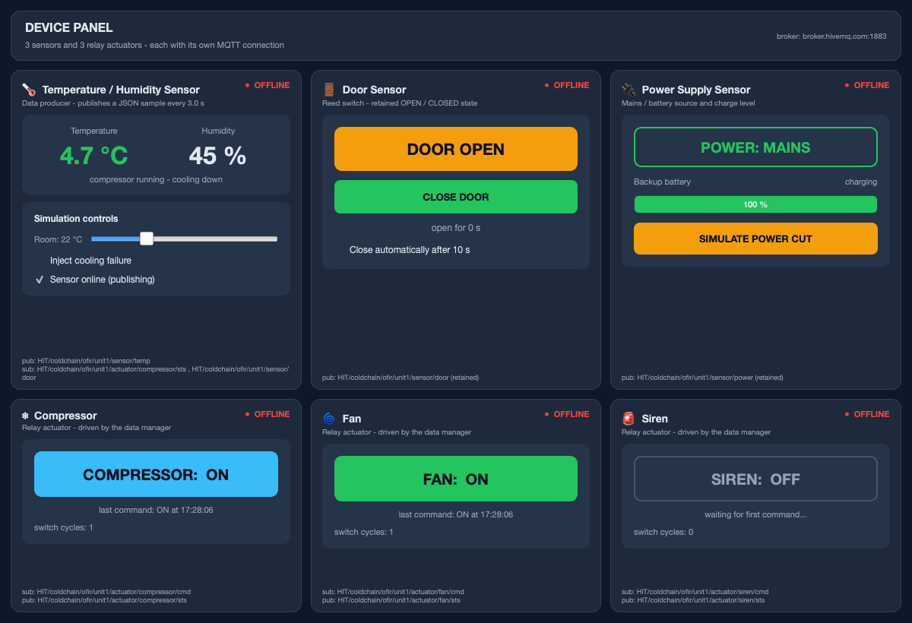

# Running the Cold Chain Monitor

Installation, launch, a demo walkthrough, and fixes for the problems you are
most likely to hit.

For what the system *is* and how it works, see [README.md](README.md).

---

## 1. Requirements

* **Python 3.8 or newer**
* An internet connection — the default broker is the public HiveMQ server
* Two Python packages, installed below: `PyQt5` and `paho-mqtt`

Check your Python:

```bash
python3 --version
```

On Windows, use `python` instead of `python3` in every command on this page.

---

## 2. Installation

Work inside a virtual environment so the project's packages stay separate from
the rest of your system.

### macOS / Linux

Open a terminal in the project folder:

```bash
cd path/to/ColdChainMonitor
```

Create the environment:

```bash
python3 -m venv .venv
```

Install the dependencies into it:

```bash
.venv/bin/pip install -r requirements.txt
```

Verify:

```bash
.venv/bin/python -c "import PyQt5, paho.mqtt; print('dependencies OK')"
```

### Windows

```
cd path\to\ColdChainMonitor
python -m venv .venv
.venv\Scripts\pip install -r requirements.txt
```

Verify:

```
.venv\Scripts\python -c "import PyQt5, paho.mqtt; print('dependencies OK')"
```

> `.venv/` is listed in `.gitignore`, so it never reaches the repository.

---

## 3. Starting everything

There are two layouts. They run identical device code and open identical MQTT
connections — six clients with six distinct client ids either way. Only the
number of windows differs.

| Mode | Processes | Windows | Best for |
|---|---|---|---|
| Separate | 8 | 8 | Showing the architecture — one process per device, like real hardware |
| Device panel | 3 | 2 | Demonstrating and recording |

### macOS / Linux

Make the launcher executable once:

```bash
chmod +x start_all.sh
```

**One window per device** (eight processes):

```bash
PYTHON="$PWD/.venv/bin/python" ./start_all.sh
```

**All devices in one window** (three processes):

```bash
PYTHON="$PWD/.venv/bin/python" ./start_all.sh --panel
```

`Ctrl-C` in that terminal stops every component.

> If you installed the packages system-wide instead of in a virtual environment,
> plain `./start_all.sh` is enough.

### Windows

Double-click `start_all.bat` for one window per device, or `start_panel.bat` for
the single-window layout. From a command prompt:

```
start_all.bat
```

```
start_panel.bat
```

Each component opens in its own console window; close them to stop.

### Which one to record

Use `--panel`. Two windows — the device panel and the main GUI — fit side by
side on one screen, so every control you press and its effect on the dashboard
are visible in the same frame.



Show the eight-process mode briefly when you explain the architecture, so it is
clear the devices really are independent clients rather than one program.

### Starting one component at a time

Useful while developing, and for showing the startup order in a presentation.
Order does not matter — retained messages and the manager's periodic actuator
refresh let any component join late.

```bash
.venv/bin/python data_manager/data_manager.py
.venv/bin/python gui/main_gui.py
.venv/bin/python emulators/temp_emulator.py
.venv/bin/python emulators/door_emulator.py
.venv/bin/python emulators/power_emulator.py
.venv/bin/python emulators/compressor_emulator.py
.venv/bin/python emulators/fan_emulator.py
.venv/bin/python emulators/siren_emulator.py
```

Or all six devices in one window:

```bash
.venv/bin/python emulators/device_panel.py
```

---

## 4. What you should see

Eight windows open. In each emulator window the indicator at the top right turns
green and reads `● CONNECTED`. In the main GUI the pill at the top reads
**ALL NORMAL** in green, and the line under the broker address reads
`● connected`.

Leave it alone for about a minute. The unit should settle into its cooling
cycle:

* temperature oscillating roughly between **3.5 °C and 6.5 °C**,
* the **COMPRESSOR** and **FAN** cards switching on and off together,
* the trend chart drawing a wave that stays inside the green band.

If that happens, the entire chain works: sensor → broker → manager → relay →
back to the sensor.

The data manager's terminal prints a summary line every ten seconds:

```
16:34:08  manager | INFO    temp=6.3 C   hum=45 %  door=CLOSED power=MAINS   comp=ON  fan=ON  siren=OFF
```

---

## 5. Demo walkthrough

Each step below triggers a different rule. Run them in order for a recording.

### Step 1 — Normal operation *(about 1 minute)*

Show the cooling cycle described above. Point out the hysteresis: the compressor
starts near 6.5 °C and stops near 3.5 °C rather than switching constantly at the
8 °C limit.

### Step 2 — Door left open *(about 50 seconds)*

In the **Door Sensor** window press `OPEN DOOR`.

| Time | What happens |
|---|---|
| immediately | The compressor is forced off — real units stop cooling with the door open |
| ~20 s | `WARNING · DOOR_OPEN` appears in the event log; the door panel turns amber |
| ~45 s | `ALARM · DOOR_OPEN`; the panel turns red, the **SIREN** card lights up, and the status pill turns red |

Press `CLOSE DOOR`. An `INFO · DOOR_OPEN_CLEARED` event appears and everything
returns to normal.

### Step 3 — Cooling failure *(about 2 minutes)*

This is the strongest demonstration, because it shows the two temperature rules
firing independently.

In the **Temperature / Humidity Sensor** window tick
**Inject cooling failure**.

| Time | What happens |
|---|---|
| — | The compressor is still commanded ON, but the temperature keeps climbing |
| above 8 °C | `WARNING · TEMP_RANGE` — left the storage band |
| above 10 °C | `ALARM · TEMP_RANGE` — past the hard limit |
| 90 s outside the band | `ALARM · TEMP_EXCURSION` — a *separate* alarm about duration, not value |

Untick the box. The compressor regains control, the temperature falls, and each
condition clears with its own event — including how long the excursion lasted.

### Step 4 — Power cut *(about 1.5 minutes)*

In the **Power Supply Sensor** window press `SIMULATE POWER CUT`.

| Time | What happens |
|---|---|
| immediately | The power panel switches to `BATTERY` and the battery bar starts draining |
| 60 s | `WARNING · POWER_BATTERY` |
| battery ≤ 20 % | `ALARM · BATTERY_LOW` |

Press `RESTORE MAINS` to recover.

### Step 5 — Sensor failure *(about 30 seconds)*

In the sensor window untick **Sensor online (publishing)**. The emulator stops
transmitting while its window stays open — a stuck sensor, not a crashed one.

After 25 s: `ALARM · SENSOR_OFFLINE`, and the status pill reads
**SENSOR OFFLINE**. Tick the box again to recover.

### Step 6 — Maintenance mode

Press **Maintenance mode** at the top right of the main GUI, then trigger any
fault from the steps above. Conditions are still logged, but the unit is not
escalated to alarm and the siren stays silent. Press **Leave maintenance** to
return.

### Step 7 — The stored record

Open the **History & Reports** tab.

* The tiles summarise the last 24 hours: sample count, min / max / average
  temperature, minutes spent out of band, warning and alarm counts.
* **READINGS** is the five-second audit trail; out-of-band temperatures are
  highlighted.
* **ALERT EVENTS** is the transition log — one row per condition start and end,
  matching what you saw live.
* **Export CSV** writes the readings to a file you can open in Excel.

---

## 6. Speeding up the demo

The default timers are realistic but slow for a 10-minute recording. To make the
alarms fire sooner, edit `config/mqtt_init.py`:

```python
DOOR_WARNING_SECONDS = 10       # default 20
DOOR_ALARM_SECONDS = 20         # default 45
EXCURSION_ALARM_SECONDS = 30    # default 90
BATTERY_WARNING_SECONDS = 20    # default 60
SENSOR_TIMEOUT_SECONDS = 15     # default 25
```

Restart the data manager afterwards — it reads these once at startup.

The **Room temperature** slider in the sensor window is another accelerator:
raising it makes the cabinet warm up much faster with the door open.

---

## 7. Stopping

**macOS / Linux:** `Ctrl-C` in the terminal running `start_all.sh` stops
everything.

If a window was started separately and is still running:

```bash
pkill -f "data_manager.py"
pkill -f "main_gui.py"
pkill -f "emulators/"
```

**Windows:** close each console window, or `Ctrl-C` in it.

On shutdown the data manager switches the siren, compressor and fan off, so the
system is left in a quiet state.

---

## 8. Troubleshooting

### `Could not find the Qt platform plugin "cocoa"` (macOS)

Some PyQt5 wheels do not export their plugin directory. `ui/qt_env.py` sets the
path automatically before the first window is created, so this should not
happen. If it still does, you likely have a stale environment variable:

```bash
unset QT_QPA_PLATFORM_PLUGIN_PATH
```

### Windows open, but the indicator stays red `● OFFLINE`

The broker is unreachable. Check your internet connection, and check whether
outbound port **1883** is blocked — some campus and corporate networks block it.
Test:

```bash
nc -vz broker.hivemq.com 1883
```

If it is blocked, switch to the college broker in `config/mqtt_init.py`:

```python
BROKER_INDEX = 0
```

That one runs on port 80, which is rarely filtered, but requires the college
network.

### Values jump around, or the log shows duplicated events

**More than one data manager is running.** Each instance writes its own rows to
the same database and sends its own actuator commands, so events appear two or
three times over and the relays fight each other.

Check:

```bash
ps aux | grep "[d]ata_manager.py"
```

There should be exactly one line. If there are more:

```bash
pkill -f "data_manager.py"
```

Then start a single one.

### Readings appear that you did not cause

Somebody else is publishing to the same topics on the public broker. Change the
namespace in `config/mqtt_init.py`:

```python
TOPIC_ROOT = 'HIT/coldchain/<your-name>/unit1'
```

Restart every component so they all agree on the new root.

### `./start_all.sh: Permission denied`

```bash
chmod +x start_all.sh
```

### `ModuleNotFoundError: No module named 'PyQt5'`

You are running the system Python instead of the virtual environment. Use the
full path:

```bash
.venv/bin/python gui/main_gui.py
```

Or activate the environment first:

```bash
source .venv/bin/activate
```

### The History tab is empty

The data manager writes a reading only every 5 seconds, and only while it is
running. Give it a minute, then press **Refresh**. If it stays empty, confirm
the manager's terminal is printing its summary lines.

### Starting over with a clean database

The database is recreated automatically on the next start:

```bash
rm database/coldchain.db*
```

---

## 9. Quick reference

| Task | Command (macOS / Linux) |
|---|---|
| Install | `python3 -m venv .venv && .venv/bin/pip install -r requirements.txt` |
| Start everything, 8 windows | `PYTHON="$PWD/.venv/bin/python" ./start_all.sh` |
| Start everything, 1 device window | `PYTHON="$PWD/.venv/bin/python" ./start_all.sh --panel` |
| Start one component | `.venv/bin/python gui/main_gui.py` |
| Stop everything | `Ctrl-C`, or `pkill -f "data_manager.py"` |
| Clear the database | `rm database/coldchain.db*` |
| Check for stray managers | `ps aux \| grep "[d]ata_manager.py"` |
